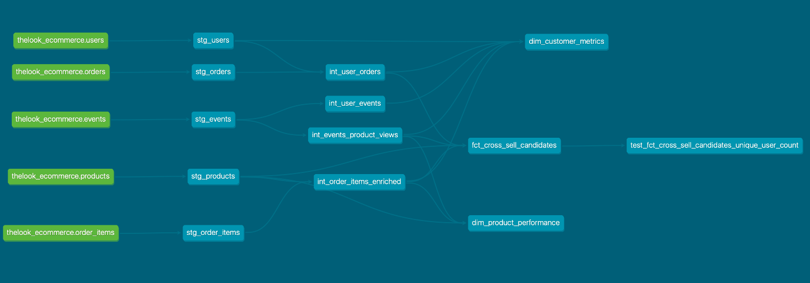

# theLook eCommerce: Customer Insights & Cross-Sell Opportunity Modeling

## Project Overview

This project explores customer engagement and product performance using the [Looker E-Commerce Dataset (BigQuery Public Data)](https://console.cloud.google.com/marketplace/product/bigquery-public-data/thelook-ecommerce). It simulates the kind of work an Analytics Engineer might do at a product-led company: building clean, modular data models that support customer segmentation, behavioral analytics, and revenue opportunity insights.

The project is built using **dbt Cloud**, with models grouped into staging, intermediate, and mart layers. All models are version-controlled in GitHub, documented using dbt, and tested where applicable—with plans to expand coverage in future iterations.

## Objective

**Goal**: Identify high-value customer segments based on behavioral engagement patterns and estimate potential revenue impact of targeted cross-sell strategies. Develop clean, modular data models to support analytics and reporting.

This includes:
- Building a reusable customer metrics mart
- Analyzing product-level views, purchases, and returns
- Flagging user-product pairs that represent missed revenue opportunities

## Project Structure

This project follows a layered dbt modeling pattern. The DAG below shows the flow of data from raw source to final marts and tests:



<pre>
models/
├── staging/
│   ├── _schema.yml
│   ├── _source.yml
│   ├── stg_users.sql
│   ├── stg_orders.sql
│   ├── stg_order_items.sql
│   ├── stg_products.sql
│   └── stg_events.sql
├── intermediate/
│   ├── _schema.yml
│   ├── int_user_orders.sql
│   ├── int_user_events.sql
│   ├── int_order_items_enriched.sql
│   └── int_event_product_views.sql
└── marts/
    ├── _schema.yml
    ├── dim_customer_metrics.sql
    ├── dim_product_performance.sql
    └── fct_cross_sell_candidates.sql
</pre>

## Key Analyses

- **Customer Segmentation**: RFM analysis to categorize customers based on recency, frequency, and monetary value.
- **Product Performance**: Identification of top-performing products and categories.
- **Cross-Sell Opportunities**: Analysis to uncover potential product pairings for cross-selling.

## Final Models (Marts)

### `dim_customer_metrics.sql`
One row per user with behavioral and transactional metrics including total events, sessions, orders, revenue, product diversity, and recency.

### `dim_product_performance.sql`
One row per product with metrics for views, purchases, revenue, profit, conversion rate, and return rate.

### `fct_cross_sell_candidates.sql`
One row per user-product pair where the user viewed a product but did not purchase it. Includes product metadata, view timestamps, and estimated lost revenue.

## Key Tools & Technologies

- **Warehouse**: Google BigQuery
- **Modeling**: dbt (Cloud)
- **Orchestration**: Apache Airflow
- **Visualization**: Looker
- **Version Control**: GitHub

## Getting Started

To explore the models yourself:
1. Clone this repo
2. Set up your `profiles.yml` with BigQuery credentials
3. Run dbt:
   ```bash
   dbt run
   dbt test
   dbt docs generate
   ```

## Future Enhancements

- Integrate automated data quality checks using more dbt tests
- Expand Looker dashboards to include more KPIs and filters
- Add segmentation logic (RFM tiers, high/medium/low engagement)
- Use BigQuery ML to predict likelihood of purchase based on behavior

## About Me

I'm currently a Solutions Advisor and Data Scientist at SAS, working in the Risk, Fraud & Compliance division. While my day-to-day role focuses on analytics, performance testing, and translating technical findings for business users, I’m also expanding my skillset into the analytics engineering and data engineering space.

This personal project is part of that growth — designed to give me hands-on experience with modern data modeling workflows, dbt-style conventions, and behavioral event data at scale. My goal is to strengthen my ability to build scalable data pipelines and support product-led growth teams with high-quality, actionable insights.