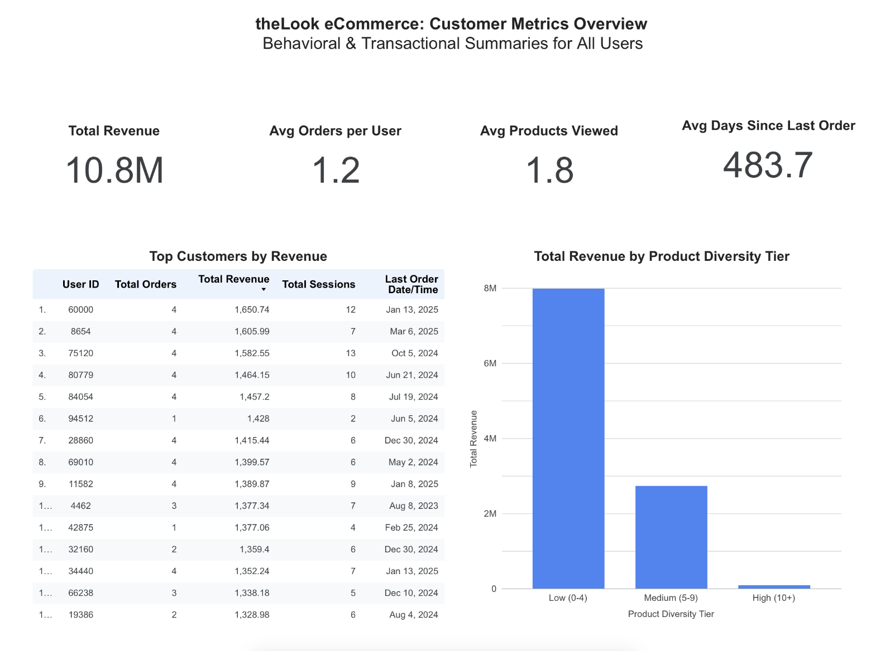

# theLook eCommerce: Customer Insights & MLOps Workflow

## Project Overview

This project explores customer engagement and product performance using the [Looker E-Commerce Dataset (BigQuery Public Data)](https://console.cloud.google.com/marketplace/product/bigquery-public-data/thelook-ecommerce). It simulates the kind of work an Analytics Engineer might do at a product-led company: building clean, modular data models that support customer segmentation, behavioral analytics, and revenue opportunity insights.  

The stack includes:
- **dbt Cloud** for modular data modeling (staging → intermediate → marts)  
- **Airflow** for orchestrating a full ML pipeline  
- **BigQuery** as the cloud data warehouse  
- **Python** for model training and evaluation  
- **Docker** for local container orchestration

## Objective

- Identify cross-sell opportunities from product view behavior  
- Develop a predictive model to estimate likelihood of purchase  
- Automate the end-to-end ML workflow inside an Airflow DAG  

## Project Structure

This project follows a layered dbt modeling pattern. The DAG below shows the flow of data from raw source to final marts and tests:

### Root Folder Structure

<pre>
.
├── dbt/                      # dbt models and configurations  
├── airflow-dbt/             # Airflow DAGs, docker-compose config, ML scripts  
├── mlops/                   # Model training script and outputs  
├── images/                  # DAG screenshots and visuals  
└── README.md
</pre>

### `dbt/` Folder Structure

<pre>
models/
├── staging/
│   ├── _schema.yml
│   ├── _source.yml
│   ├── stg_users.sql
│   ├── stg_orders.sql
│   ├── stg_order_items.sql
│   ├── stg_products.sql
│   └── stg_events.sql
├── intermediate/
│   ├── _schema.yml
│   ├── int_user_orders.sql
│   ├── int_user_events.sql
│   ├── int_order_items_enriched.sql
│   └── int_event_product_views.sql
└── marts/
    ├── _schema.yml
    ├── dim_customer_metrics.sql
    ├── dim_product_performance.sql
    ├── fct_cross_sell_model_training.sql
    └── fct_cross_sell_candidates.sql
</pre>

## Dashboard (Looker Studio)

An interactive dashboard built in Looker Studio visualizes customer engagement patterns and cross-sell opportunities from the dbt-modeled data in BigQuery.

🔗 [Click here to view the live dashboard](https://lookerstudio.google.com/reporting/8526155c-f917-492c-8140-948651a2af2f)

Key insights include:
- Top customers by revenue and engagement behavior
- Distribution of revenue by product engagement tier
- Summary stats including average recency, orders per user, and products viewed

## Final Models (Marts)

### `dim_customer_metrics.sql`
One row per user with behavioral and transactional metrics including total events, sessions, orders, revenue, product diversity, and recency.

### `dim_product_performance.sql`
One row per product with metrics for views, purchases, revenue, profit, conversion rate, and return rate.

### `fct_cross_sell_candidates.sql`
One row per user-product pair where the user viewed a product but did not purchase it. Includes product metadata, view timestamps, and estimated lost revenue.

### `fct_cross_sell_model_training.sql`
One row per user-product pair. Includes product metadata, view timestamps, and estimated lost revenue. Used for ML model training.

## Key Components

- Logistic regression model (sklearn) to predict purchase probability
- Evaluation metrics (AUC, precision, recall, F1)
- Model and metadata saved to disk

## Getting Started

To explore the models yourself:
1. Clone this repo and `cd airflow-dbt/`
2. Mount your BigQuery service account and`.dbt/profiles.yml`
3. Run `docker compose up -d`
4. Login to Airflow UI
4. Trigger the DAG from the Airflow UI

## About Me

I'm currently a Solutions Advisor and Data Scientist at SAS, working in the Risk, Fraud & Compliance division. While my day-to-day role focuses on analytics, performance testing, and translating technical findings for business users, I’m also expanding my skillset into the analytics engineering and data engineering space.

This personal project is part of that growth — designed to give me hands-on experience with modern data modeling workflows, dbt-style conventions, and behavioral event data at scale. My goal is to strengthen my ability to build scalable data pipelines and support product-led growth teams with high-quality, actionable insights.